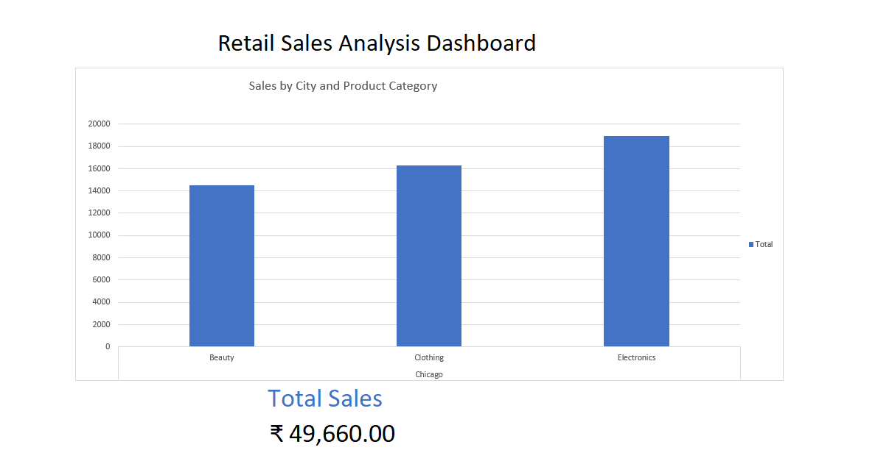

# 📊 Retail Sales Excel Dashboard

## 📌 Project Overview

This project is an interactive Retail Sales Dashboard built using Microsoft Excel.  
It analyzes sales data using Pivot Tables, Pivot Charts, and dashboard design techniques.

The dashboard provides insights into:

- Sales by City  
- Sales by Product Category  
- Total Revenue  
- Order Trends  

---

## 🛠 Tools Used

- Microsoft Excel  
- Pivot Tables  
- Pivot Charts  
- GETPIVOTDATA  
- Data Formatting & Dashboard Design  

---

## 📂 Dataset Information

The dataset includes:

- Order ID  
- Date  
- Customer ID  
- Gender & Age  
- Product Category  
- Payment Method  
- City  
- Store Type  
- Quantity  
- Price per Unit  
- Total Amount  
- Delivery Status  
- High Value Order  

**Total Records:** 1000+ rows  

---

## 📈 Dashboard Features

- 📊 Sales by City & Product Category (Bar Chart)  
- 💰 Dynamic Total Sales Calculation  
- 📑 Pivot Table Summary  
- 🎨 Clean Dashboard Layout  
- 📌 Interactive Analysis using Excel features  

---

## 🖼 Dashboard Preview

---

## 📊 Key Insights

- Electronics category generates the highest revenue.  
- Chicago shows strong category performance.  
- High-value orders contribute significantly to total sales.  

---

## 🚀 How to Use

1. Download the Excel file.  
2. Open in Microsoft Excel.  
3. Use Pivot controls to explore the data.  
4. Modify filters to analyze different segments.  

---

## 🎯 Learning Outcome

Through this project, I improved my skills in:

- Data analysis using Excel  
- Building professional dashboards  
- Using Pivot Tables & GETPIVOTDATA  
- Structuring datasets for business insights  
